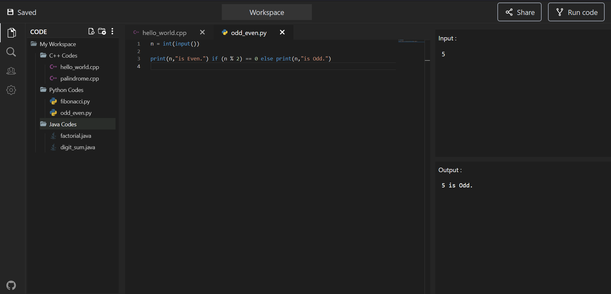

# CodeDoodle
> This is an online code compiler/editor.

## Technologies Used
- Backend - ExpressJS
- Compilation - JDoodle
- Frontend - React & RTK

## Features
List the ready features here:
- Syntax highlighting & Compilation is provided for all the major programming languages.
- It has a filetree to manage all of your files and folders.
- Editor also supports tabs, for easy and quick navigation between multiple files.

## Screenshots

<!-- If you have screenshots you'd like to share, include them here. -->

## Usage
Install dependencies for backend and frontend separately.  
Then, run the backend and frontend individually.  
Change the name of `.env.example` to `.env` in backend.  
Backend : `node server.js`  
Frontend: `npm run dev`

## Room for Improvement

To do:
- Rename file & folder.
- Delete file & folder.
- Save all the data in localstorage.

## Contact
Created by [@ashishpandagre](https://www.linkedin.com/in/ashish-pandagre/) - feel free to contact me!

<!-- Optional -->
<!-- ## License -->
<!-- This project is open source and available under the [... License](). -->

<!-- You don't have to include all sections - just the one's relevant to your project -->
